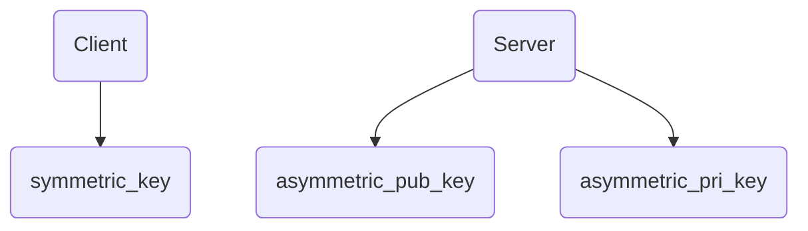
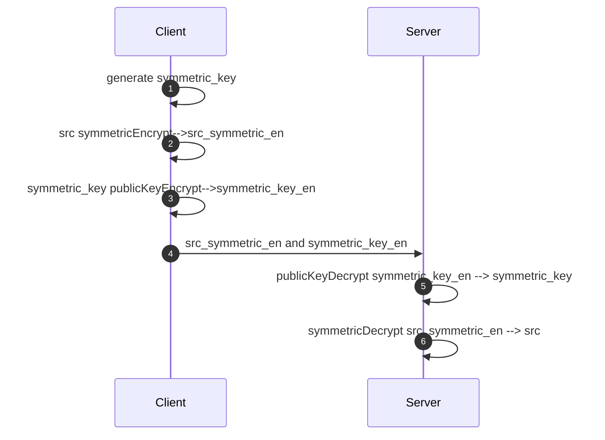
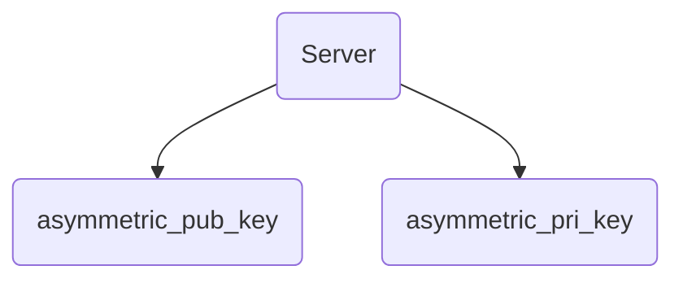
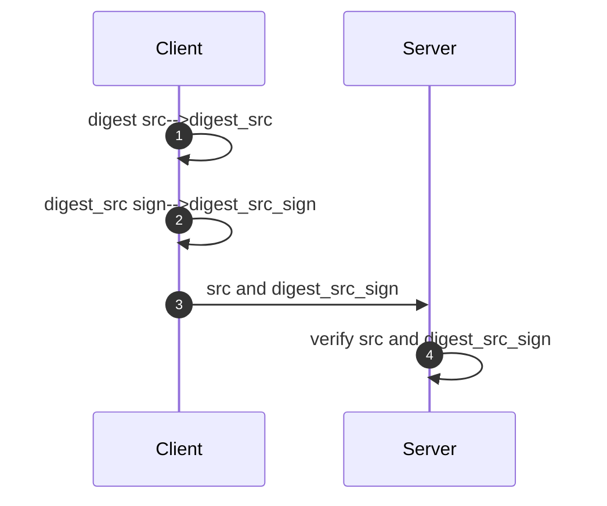

### ENV
android studio 4.0.1

java version "1.8.0_261"

ndk version 21.3.6528147

### build GmSSL

默认openssl/opensslconf.h.in Cmake是无法直接编译通过的，可通过编译静态库获取。

```shell
git clone https://github.com/guanzhi/GmSSL
cd GmSSL
mkdir build && cd build
./build_android_v7a.sh
cd ..
mkdir build64 && cd build64
./build_android_arm64.sh
```

build_android_v7a.sh 只是32位。参考[编译与安装](http://gmssl.org/docs/install.html)

```shell
#!/bin/bash

ANDROID_PATH=/Users/wushengping/Library/Android
PLATFORM_VERSION=22

MAKE_TOOLCHAIN=$ANDROID_PATH/sdk/ndk/21.3.6528147/build/tools/make-standalone-toolchain.sh
export TOOLCHAIN_PATH=$ANDROID_PATH/android-toolchain-arm
$MAKE_TOOLCHAIN --arch=arm --platform=android-$PLATFORM_VERSION --install-dir=$TOOLCHAIN_PATH

export MACHINE=armv7
export SYSTEM=android
export ARCH=arm
export CROSS_SYSROOT=$TOOLCHAIN_PATH/sysroot
export TOOL_BASENAME=$TOOLCHAIN_PATH/bin/arm-linux-androideabi
export CC=$TOOL_BASENAME-gcc
export CXX=$TOOL_BASENAME-g++
export LD=$TOOL_BASENAME-ld
export LINK=$CXX
export AR=$TOOL_BASENAME-ar
export RANLIB=$TOOL_BASENAME-ranlib
export STRIP=$TOOL_BASENAME-strip

../config
make
```

build_android_arm64.sh 是64位的。参考[Gmssl 各平台编译方法](https://blog.csdn.net/qq_19734597/article/details/103264132)

```shell
#!/bin/bash

ANDROID_PATH=/Users/wushengping/Library/Android
PLATFORM_VERSION=22

MAKE_TOOLCHAIN=$ANDROID_PATH/sdk/ndk/21.3.6528147/build/tools/make-standalone-toolchain.sh
export TOOLCHAIN_PATH=$ANDROID_PATH/aarch64-linux-android
$MAKE_TOOLCHAIN --arch=arm64 --platform=android-$PLATFORM_VERSION --install-dir=$TOOLCHAIN_PATH

export MACHINE=armv8
export SYSTEM=android-v8
export ARCH=arm64
export CROSS_SYSROOT=$TOOLCHAIN_PATH/sysroot
export TOOL_BASENAME=$TOOLCHAIN_PATH/bin/aarch64-linux-android
export CC=$TOOL_BASENAME-gcc
export CXX=$TOOL_BASENAME-g++
export LD=$TOOL_BASENAME-ld
export LINK=$CXX
export AR=$TOOL_BASENAME-ar
export RANLIB=$TOOL_BASENAME-ranlib
export STRIP=$TOOL_BASENAME-strip

../config
make
```

编译结束获取build和build64文件夹下的libcrypto.a , libssl.a 和 opensslconf.h

### 生成公私钥Pem

1. 生成私钥

   ```shell
   openssl ecparam -genkey -name SM2 -out sm2_private_key.pem
   ```

2. 私钥转换pkcs8

   ```shell
   openssl pkcs8 -topk8 -inform PEM -in sm2_private_key.pem -outform pem -nocrypt -out private_key.pem
   ```

3. 生产公钥

   ```shell
   openssl ec -in sm2_private_key.pem -pubout -out public_key.pem
   ```

### 数字信封和数字签名流程

#### 数字信封

Client 生成对称密钥:symmetric_key

Server 生成非对称密钥的公钥和私钥:asymmetric_pub_key & asymmetric_pri_key


1. Client 使用generateRandom(16)，生成对称密钥。symmetric_key

2. Client 使用symmetricEncrypt()和对称密钥，对明文进行加密。src_symmetric_en

3. Client 使用publicKeyEncrypt()和Server的公钥，加密**对称密钥**。symmetric_key_en

4. Client 将加密后的密文和加密后的对称密钥提供给Server端。

5. Server使用publicKeyDecrypt()和Server的私钥，解密得道对称密钥。symmetric_key

6. Server使用symmetricDecrypt()和对称密钥，解密密文得到明文。src



#### 数字签名过程

Server 生成非对称密钥的公钥和私钥:asymmetric_pub_key & asymmetric_pri_key

1. Client 使用digest()，对src 计算摘要。digest_src
2. Client 使用sign()和Server公钥，对digest_src进行签名。digest_src_sign
3. Client 将digest_src_sign 和 src 发送给Server
4. Server 使用verify() 对digest_src_sign 和 digest_src进行验签。




